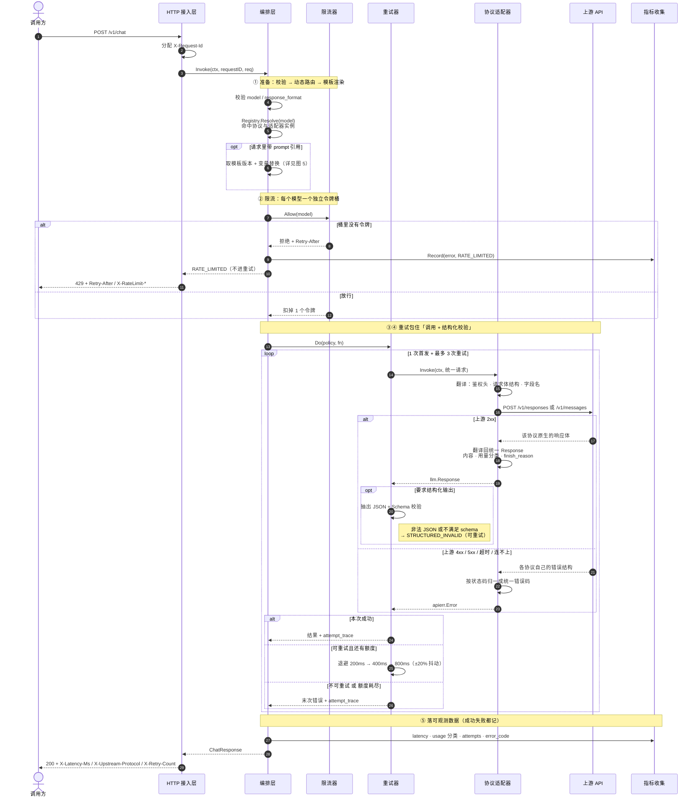
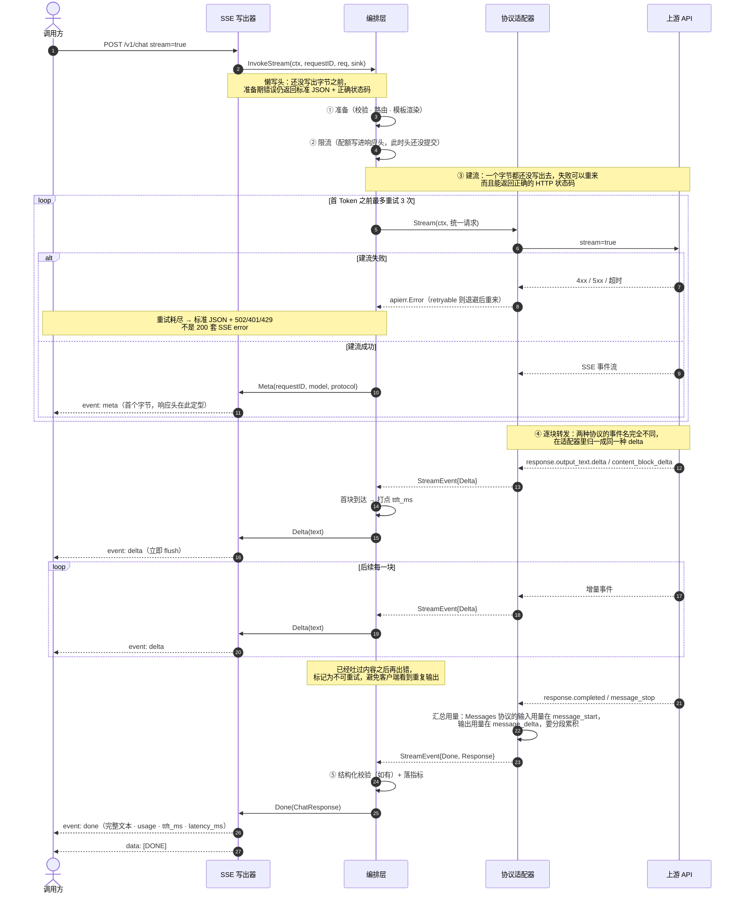
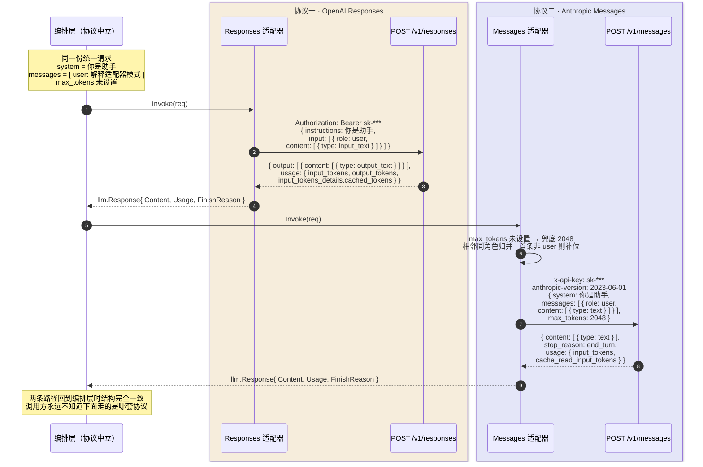
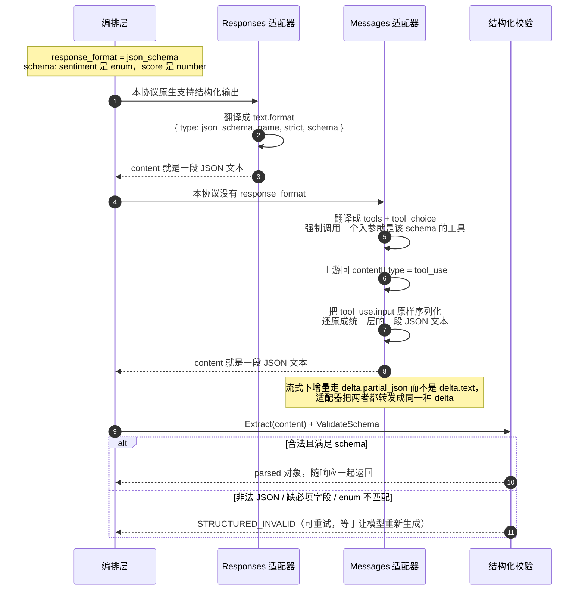
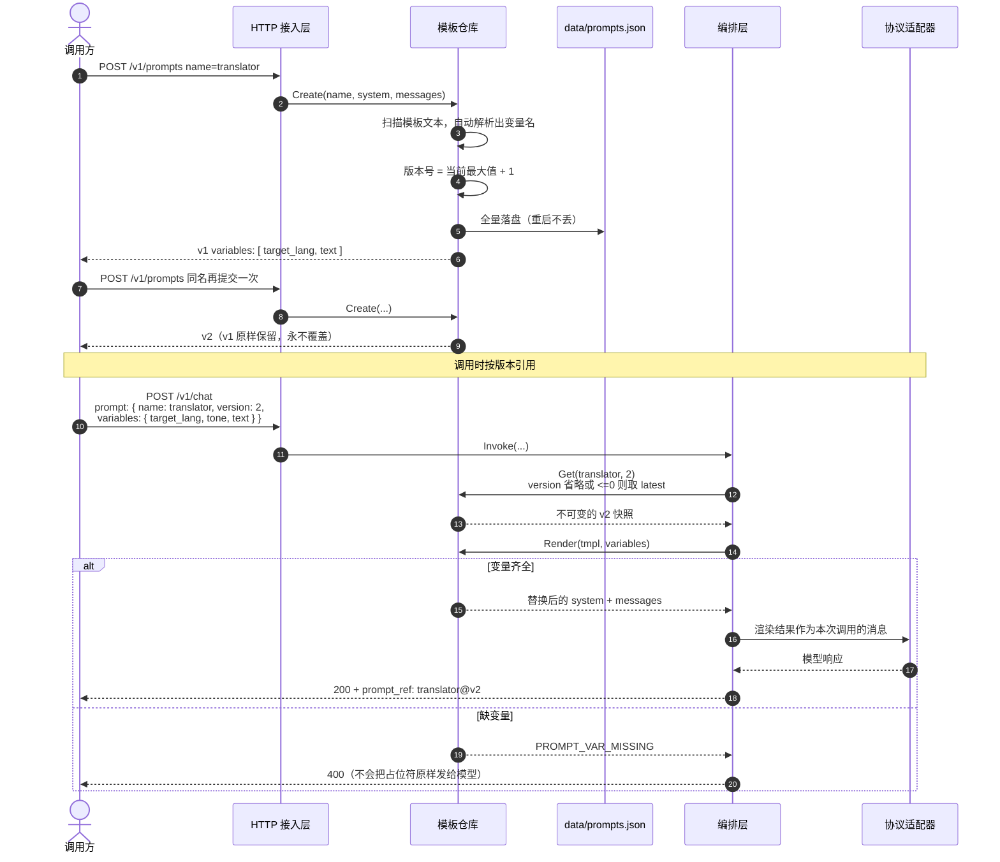

# 调用时序图

五张图覆盖六大功能点的全部流转。图里的编号与 `internal/service/gateway.go` 里的 ①②③④⑤ 注释一一对应。

- [1. 非流式主流程](#1-非流式主流程)——统一抽象层、限流、重试、统一错误码、可观测
- [2. 流式输出](#2-流式输出sse)——SSE 逐块下发、首 Token 延迟打点、首块之前可重试
- [3. 双协议翻译](#3-双协议翻译)——同一份统一请求落到上游是两份完全不同的报文
- [4. 结构化输出](#4-结构化输出)——两种协议、两条实现路径、一套兜底校验
- [5. 提示词版本引用](#5-提示词版本引用)——存储、变量替换、按版本引用

---

## 1. 非流式主流程

`internal/service/gateway.go` · `Invoke()`

调用方只递一份统一请求。校验与动态路由决定了走哪套协议，限流按模型独立扣令牌，重试把「调用 + 结构化校验」整体包住——所以模型吐出非法 JSON 也会被当成一次可重试的失败。无论成功失败，最后都会落一条可观测记录。

**读图要点**

- 限流失败**不进重试**：本地配额问题重试没有意义，直接 429 抛给调用方。
- 结构化校验在重试圈**里面**：模型偶尔吐出带解释文字的 JSON，重试一次通常就好了。
- `attempt_trace` 会随响应返回，每次失败的错误码和实际退避时长都能看到。
- **用量按尝试累计**：只要上游返回了响应，Token 就已经计费，哪怕结果因为 JSON 不合法被判废。指标里记的是真实花销，不是最后一次的用量。

---

## 2. 流式输出（SSE）

`internal/service/gateway.go` · `InvokeStream()`

SSE 写出器采用「懒写头」：在真正吐出第一个字节之前，准备阶段的错误仍然能以标准 JSON + 正确状态码返回。首块内容到达时打点 `ttft_ms`。一旦开始输出就不再重试——否则客户端会看到重复内容。

**读图要点**

- `meta` 事件把本次实际命中的协议回传给客户端，方便排查。
- 所有 `delta` 拼接起来必须等于 `done` 里的完整文本，验收脚本对这一条有断言。
- `[DONE]` 哨兵是为了兼容按 OpenAI 习惯写的客户端。
- **断流不算成功**：上游没发终止事件就断开，一律报 `UPSTREAM_ERROR`，绝不拿半段文字冒充完整回复。
- **meta 发在上游握手之后**：这样建流阶段的失败还能返回正确的 HTTP 状态码（502/401/429），而不是先写 200 再用 SSE `error` 事件找补。成功路径的事件顺序完全不变，meta 仍是客户端收到的第一个事件。

---

## 3. 双协议翻译

`internal/llm/openai_responses.go` · `internal/llm/anthropic_messages.go`

同一份统一请求，经过两个适配器之后，落到上游是两份连字段名都对不上的报文；两份原生响应回来，又被还原成同一种结构。这就是「协议差异被适配器吃掉」的全部含义。

**读图要点**

- 鉴权就不一样：`Authorization: Bearer` 对 `x-api-key` + `anthropic-version`。
- `system` 一个叫 `instructions` 放顶层，一个叫 `system` 放顶层但**不允许**出现在消息数组里。
- `max_tokens` 在 Messages 协议里是必填，统一层没给就由适配器兜底。
- 用量字段名也不同：`input_tokens_details.cached_tokens` 对 `cache_read_input_tokens`，归一到同一个 `Usage`。

内置假上游 `cmd/mockupstream` 对这些差异做了强校验（缺 `anthropic-version` 或 `max_tokens` 直接 400），并提供 `GET /mock/last-request` 取证端点，可以直接看到上游实际收到了什么。

---

## 4. 结构化输出

`internal/llm` 适配器 + `internal/structured`

Responses 协议原生支持 `text.format`；Messages 协议根本没有 `response_format`，只能翻译成「强制调用一个入参就是目标 schema 的工具」，再把 `tool_use.input` 还原回一段 JSON 文本。两条路径殊途同归，最后都过一遍网关侧的兜底校验。

**读图要点**

- `Extract` 容忍模型加的 Markdown 代码围栏和前后解释文字，会截出最外层的 JSON 主体。
- 网关侧再校验一遍的意义：三种协议对结构化输出的支持强度不同，只有在这一层统一校验，调用方才能拿到一致的保证。
- 第三条真实通道（DeepSeek 的 Chat Completions）只支持 `json_object`，适配器会把 `json_schema` 降级成 `json_object` 并把 schema 作为约束注入 system。

---

## 5. 提示词版本引用

`internal/prompt/store.go`

同名模板每次提交都追加一个新版本，历史版本不可变、永远可以被引用。变量从模板文本里自动解析；调用时缺变量会直接报错，而不是把占位符原样发给模型。

**读图要点**

- `prompt_ref` 会随响应返回并写进可观测记录，能追出「这次调用用的是哪个模板的哪一版」。
- 模板的 `system` 排在调用方 `system` 之前，模板消息排在显式 `messages` 之前，可以叠加使用。
- `POST /v1/prompts/:name/render` 只做渲染预览，不调模型，用来在花 Token 之前确认替换结果。
